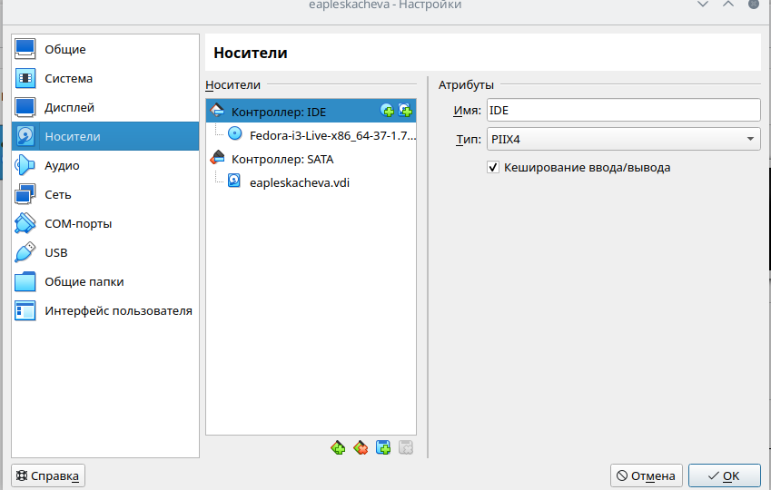

---
## Front matter
title: "Отчет по лабораторной работе №1"
subtitle: "Установка и конфигурация операционной системы на виртуальную машину"
author: "Плескачева Елизавета Андреевна НММ-02-22бд"

## Generic otions
lang: ru-RU
toc-title: "Содержание"

## Bibliography
bibliography: bib/cite.bib
csl: pandoc/csl/gost-r-7-0-5-2008-numeric.csl

## Pdf output format
toc: true # Table of contents
toc-depth: 2
lof: true # List of figures
lot: true # List of tables
fontsize: 12pt
linestretch: 1.5
papersize: a4
documentclass: scrreprt
## I18n polyglossia
polyglossia-lang:
  name: russian
  options:
	- spelling=modern
	- babelshorthands=true
polyglossia-otherlangs:
  name: english
## I18n babel
babel-lang: russian
babel-otherlangs: english
## Fonts
mainfont: PT Serif
romanfont: PT Serif
sansfont: PT Sans
monofont: PT Mono
mainfontoptions: Ligatures=TeX
romanfontoptions: Ligatures=TeX
sansfontoptions: Ligatures=TeX,Scale=MatchLowercase
monofontoptions: Scale=MatchLowercase,Scale=0.9
## Biblatex
biblatex: true
biblio-style: "gost-numeric"
biblatexoptions:
  - parentracker=true
  - backend=biber
  - hyperref=auto
  - language=auto
  - autolang=other*
  - citestyle=gost-numeric
## Pandoc-crossref LaTeX customization
figureTitle: "Рис."
tableTitle: "Таблица"
listingTitle: "Листинг"
lofTitle: "Список иллюстраций"
lotTitle: "Список таблиц"
lolTitle: "Листинги"
## Misc options
indent: true
header-includes:
  - \usepackage{indentfirst}
  - \usepackage{float} # keep figures where there are in the text
  - \floatplacement{figure}{H} # keep figures where there are in the text
---

# Цель работы

Приобретение практических навыков установки операционной системы на виртуальную машину, настройки минимально необходимых для дальнейшей работы сервисов.

# Задания

Создать виртуальную машину, установить операционную систему,выполнить все требуемые настройки и установить требуемые программы

# Выполнение лабораторной работы

## Настройка каталога для виртуальных машин

## Создание виртуальной машины

## Установка системы на диск

## Действия после установки 

## Установка драйверов для VirtualBox

#Домашнее задание
Получили следующую информацию:

# Контрольные вопросы

1. Какую информацию содержит учетная запись пользователя?
Имя пользователя (user name)
Индентификационный номер пользвателя (UID)
Индентификационный номер группы (GID)
Пароль (password)
Полное имя (full name)
Домашний каталог (home directory)
Начальную оболочку (login shell)

2. Укажите команды терминала и приведите примеры:

    для получения справки по команд
    -help
    для перемещения по файловой системе
    -cd
    для просмотра содержимого каталога
    -ls
    для определения объёма каталога
    -du
    для создания / удаления каталогов / файлов
    -mkdir / rm -r 
    для задания определённых прав на файл / каталог
    -touch/rm
    для просмотра истории команд
    -history

3. Что такое файловая система? Приведите примеры с краткой характеристикой
 Файловая система - порядок, определяющий способ организациии, хранения и наименования данных на носителях в пк, а также в другом электронном оборудовании: мобильных телефонах или цифровых фотоаппаратах. Она так же определяет формат содержимого и способ физического хранения информации. Некоторые могут представлять сервисные возможности, например, разграничение доступа
 
 4. Как посмотреть, какие файловые системы подмонтированы в ОС?
 Df - утилита, которая показывает список всех файловых систем по имени устройства, сообщает их размер, занятое и свободное пространство и точки монтировния. 
 
 5. Как удалить зависший процесс?
 
с помощью команды killall-killall().

# Выводы

Приобрели практические навыки установки операционной системы на виртуальную машину и настройки необходимых для дальнейшей работы сервисов.

