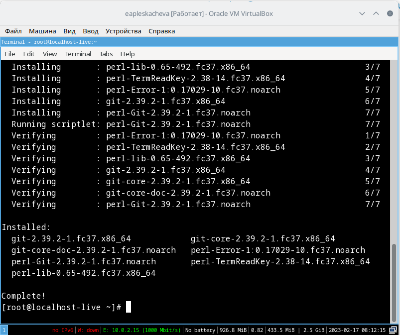
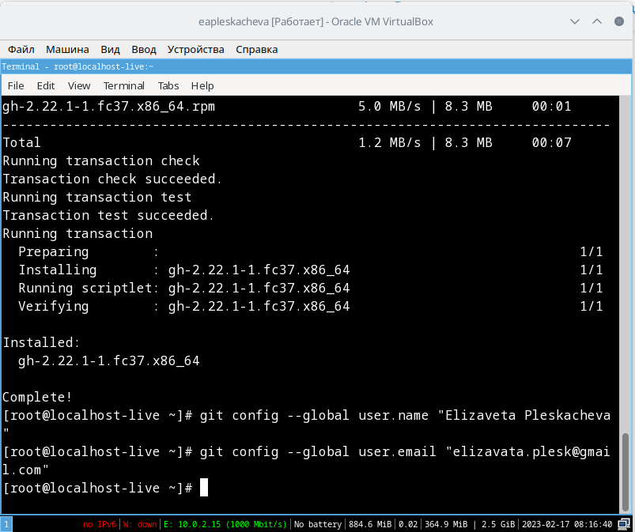
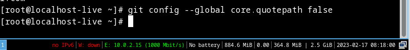
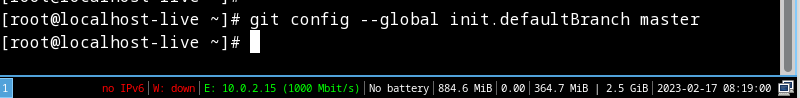
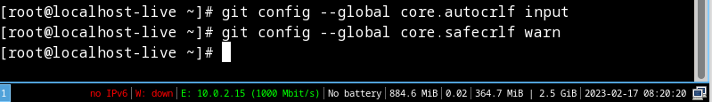
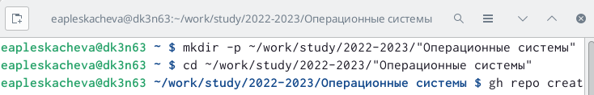
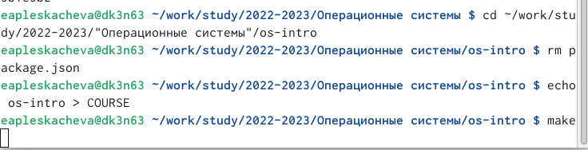
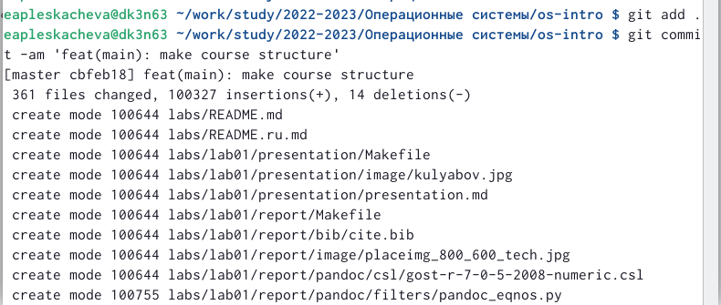

---
## Front matter
lang: ru-RU
title: Презентация по лабораторной работе №2
subtitle: Первоначальная настройка git
author:
  - Плескачева Е.А.
institute:
  - Российский университет дружбы народов, Москва, Россия
date: 25 февраля 2023

## i18n babel
babel-lang: russian
babel-otherlangs: english

## Formatting pdf
toc: false
toc-title: Содержание
slide_level: 2
aspectratio: 169
section-titles: true
theme: metropolis
header-includes:
 - \metroset{progressbar=frametitle,sectionpage=progressbar,numbering=fraction}
 - '\makeatletter'
 - '\beamer@ignorenonframefalse'
 - '\makeatother'
---

# Информация

## Докладчик

:::::::::::::: {.columns align=center}
::: {.column width="70%"}

  * Плескачева Елизавета Андреевна
  * учебная группа: НММбд-02-22
  * студент направления Математика и Механика
  * Российский университет дружбы народов
  * [1132226461@pfur.ru](mailto:1132226461@pfur.ru)
  * <https://github.com/kukusb>

:::
::: {.column width="30%"}

:::
::::::::::::::

# Вводная часть

## Цель работы

Изучить идеологию и применение средств контроля версий и освоить умения по работе с git

## Задание

Установить git, выполнить базовую настройку, создать ключ, создать репозиторий курса и настроить его

# Выполнение лабораторной работы

## Шаг 1

## Шаг 2

## Шаг 3

## Шаг 4

## Шаг 5

## Шаг 6

ssh ключ уже был создан нами во время выполнения лабораторной работы в прошлом семестре, для удобства будем использовать его

## Шаг 7

## Шаг 8

## Шаг 9

# Результаты работы

## Выводы

Научились работать с git, изучили идеологию и контроль над версиями.

