---
## Front matter
lang: ru-RU
title: Презентация по лабораторной работе №4
subtitle: Основы интерфейса взаимодействия пользователя с системой Unix на уровне командной строки
author:
  - Плескачева Е.А.
institute:
  - Российский университет дружбы народов, Москва, Россия
date: 25 февраля 2023

## i18n babel
babel-lang: russian
babel-otherlangs: english

## Formatting pdf
toc: false
toc-title: Содержание
slide_level: 2
aspectratio: 169
section-titles: true
theme: metropolis
header-includes:
 - \metroset{progressbar=frametitle,sectionpage=progressbar,numbering=fraction}
 - '\makeatletter'
 - '\beamer@ignorenonframefalse'
 - '\makeatother'
---

# Информация

## Докладчик

:::::::::::::: {.columns align=center}
::: {.column width="70%"}

  * Плескачева Елизавета Андреевна
  * учебная группа: НММбд-02-22
  * студент направления Математика и Механика
  * Российский университет дружбы народов
  * [1132226461@pfur.ru](mailto:1132226461@pfur.ru)
  * <https://github.com/kukusb>

:::
::: {.column width="30%"}

:::
::::::::::::::

# Вводная часть

## Цель работы

 Приобретение практических навыков взаимодействия пользователя с системой посредством командной строки.

## Задание

 Ознакомиться с форматами команд cd,ls,pwd,mkdir и другими. Выполнить список заданий на отработку этих команд.

# Выполнение лабораторной работы

## Шаг 1

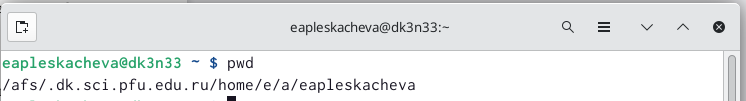

## Шаг 2

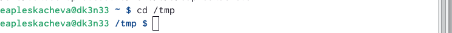

## Шаг 3

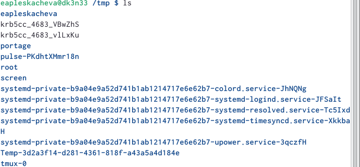

## Шаг 4

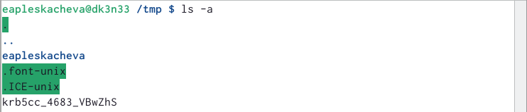

## Шаг 5

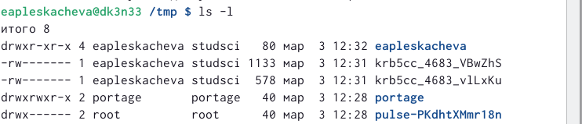

## Шаг 6

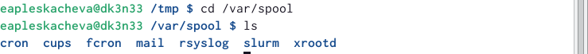

## Шаг 7

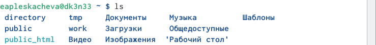

## Шаг 8

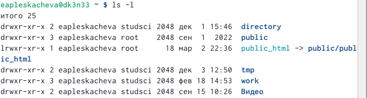

## Шаг 9

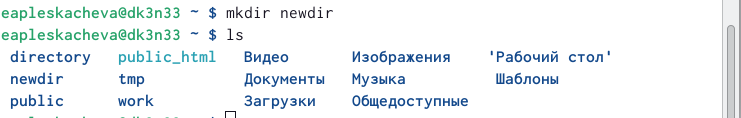

## Шаг 10

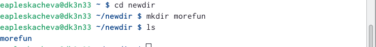

## Шаг 11

## Шаг 12

## Шаг 13

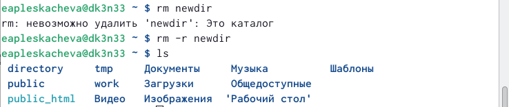

## Шаг 14

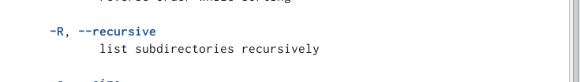

## Шаг 15

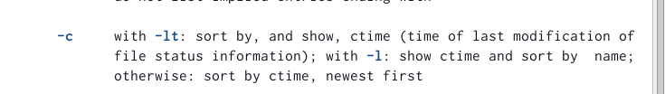

## Шаг 16

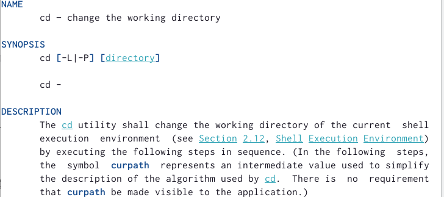

## Шаг 17

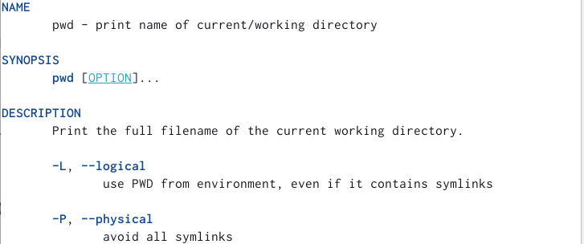

## Шаг 18

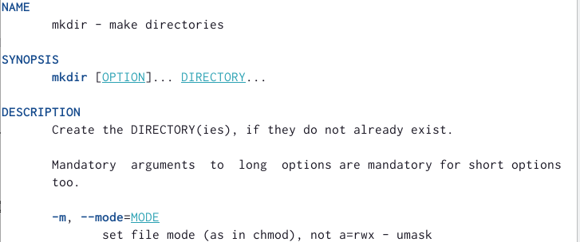

## Шаг 19

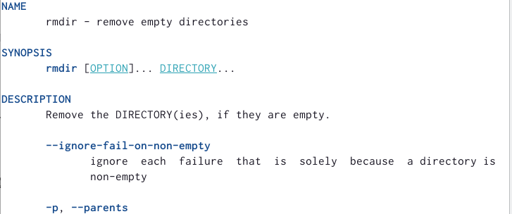

## Шаг 20

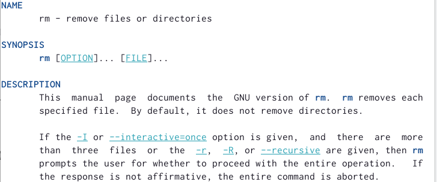

## Шаг 21

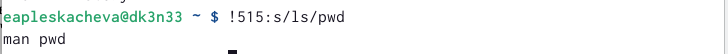

## Шаг 22

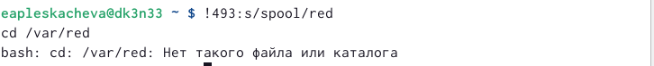

# Результаты работы

Выполнили поставленный задачи с отработкой выученных команд.

## Выводы

 Приобрели практическе навыки взаимодействия пользователя с системой посредством командной строки.

