---
## Front matter
lang: ru-RU
title: Презентация по лабораторной работе №5
subtitle: Анализ файловой системы Linux. Команды для работы с файлами и каталогами
author:
  - Плескачева Е.А.
institute:
  - Российский университет дружбы народов, Москва, Россия
date: 10 марта 2023

## i18n babel
babel-lang: russian
babel-otherlangs: english

## Formatting pdf
toc: false
toc-title: Содержание
slide_level: 2
aspectratio: 169
section-titles: true
theme: metropolis
header-includes:
 - \metroset{progressbar=frametitle,sectionpage=progressbar,numbering=fraction}
 - '\makeatletter'
 - '\beamer@ignorenonframefalse'
 - '\makeatother'
---

# Информация

## Докладчик

:::::::::::::: {.columns align=center}
::: {.column width="70%"}

  * Плескачева Елизавета Андреевна
  * учебная группа: НММбд-02-22
  * студент направления Математика и Механика
  * Российский университет дружбы народов
  * [1132226461@pfur.ru](mailto:1132226461@pfur.ru)
  * <https://github.com/kukusb>

:::
::: {.column width="30%"}

:::
::::::::::::::

# Вводная часть

## Цель работы

Ознакомление с файловой системой Linux, её структурой, именами и содержанием каталогов. Приобретение практических навыков по применению команд для работы с файлами и каталогами, по управлению процессами (и работами), по проверке использования диска и обслуживанию файловой системы.

## Задание

Повторить команды-примеры. Выполнить задания для самостоятельной работы для приобретения навыков применения команд системы Linux.

# Выполнение лабораторной работы

## Шаг 1

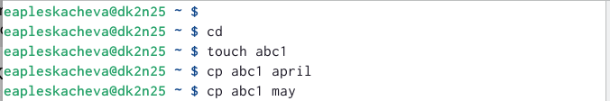

## Шаг 2

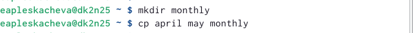

## Шаг 3

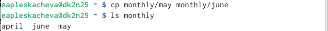

## Шаг 4

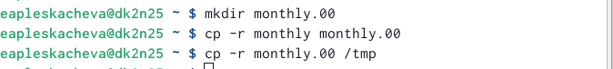

## Шаг 5

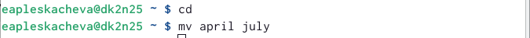

## Шаг 6

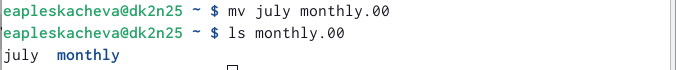

## Шаг 7

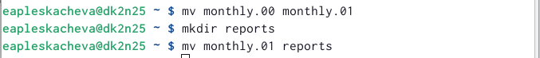

## Шаг 8

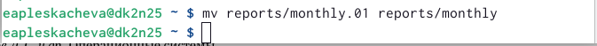

## Шаг 9

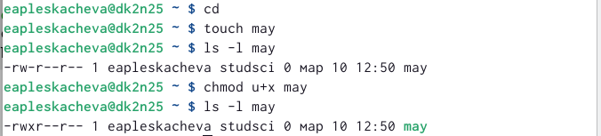

## Шаг 10

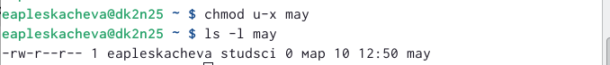

## Шаг 11

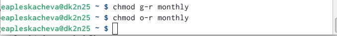

## Шаг 12

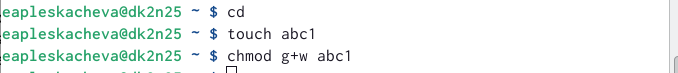

## Шаг 13

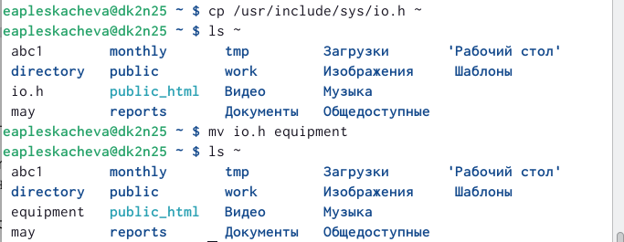

## Шаг 14

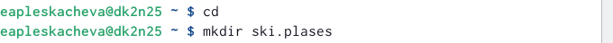

## Шаг 15

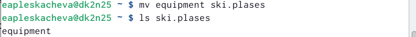

## Шаг 16

## Шаг 17

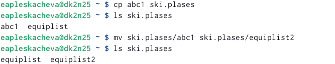

## Шаг 18

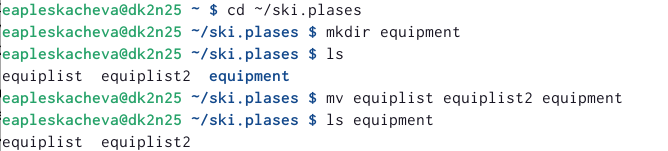

## Шаг 19

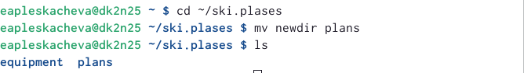

## Шаг 20

Определение опции команды chmod

 1. australia (a+r u+w u+x)
 2. play (a+x u+r u+w)
 3. my_os (a+r u+x)
 4. feathers (a+r a+w o-w)
 
## Шаг 21 

Выполнение упражнений 

 1. Просмотрели содержимое файла с помощью команды ls /etc/password
 2. Скопировали файл ~/feathers в файл ~/file.old с помощью команды cp ~/feathers ~/file.old
 3. Переместили файл ~/file.old в каталог ~/play с помощью команды mv file.old ~/play
 4. Скопировали каталог ~/play в каталог ~/fun с помощью команды cp
 5. Переместили каталог ~/fun в каталог ~/play и назовите его games с помощью команды mv ~/fun ~/play/games
 6. Лишили владельца файла ~/feathers права на чтение с помощью команды chmod u-r
 7. Если просмотреть файл ~/feathers командой cat, то выдаётся ошибка “Отказано в доступе”
 8. Скопировать файл feathers не удаётся по той же ошибке
 9. Дали владельцу файла ~/feathers право на чтение с помощью команды
chmod u+r
 10. Лишили владельца каталога ~/play права на выполнение с помощью команды chmod u-x
 11. После выполнения команды перейти в каталог play не представляется возможным
 12. Дали владельцу каталога ~/play право на выполнение с помощью команды chmod u+x

# Результаты работы

## Выводы

Ознакомились с файловой системой Linux, её структурой, именами и содержанием каталогов. Приобрели практические навыки по применению команд для работы с файлами и каталогами, по управлению процессами (и работами), по проверке использования диска и обслуживанию файловой системы

