---
## Front matter
title: "Отчёт по лабораторной работе №5"
subtitle: "Анализ файловой системы Linux. Команды для работы с файлами и каталогами"
author: "Плескачева Елизавета Андреевна"

## Generic otions
lang: ru-RU
toc-title: "Содержание"

## Bibliography
bibliography: bib/cite.bib
csl: pandoc/csl/gost-r-7-0-5-2008-numeric.csl

## Pdf output format
toc: true # Table of contents
toc-depth: 2
lof: true # List of figures
lot: true # List of tables
fontsize: 12pt
linestretch: 1.5
papersize: a4
documentclass: scrreprt
## I18n polyglossia
polyglossia-lang:
  name: russian
  options:
	- spelling=modern
	- babelshorthands=true
polyglossia-otherlangs:
  name: english
## I18n babel
babel-lang: russian
babel-otherlangs: english
## Fonts
mainfont: PT Serif
romanfont: PT Serif
sansfont: PT Sans
monofont: PT Mono
mainfontoptions: Ligatures=TeX
romanfontoptions: Ligatures=TeX
sansfontoptions: Ligatures=TeX,Scale=MatchLowercase
monofontoptions: Scale=MatchLowercase,Scale=0.9
## Biblatex
biblatex: true
biblio-style: "gost-numeric"
biblatexoptions:
  - parentracker=true
  - backend=biber
  - hyperref=auto
  - language=auto
  - autolang=other*
  - citestyle=gost-numeric
## Pandoc-crossref LaTeX customization
figureTitle: "Рис."
tableTitle: "Таблица"
listingTitle: "Листинг"
lofTitle: "Список иллюстраций"
lotTitle: "Список таблиц"
lolTitle: "Листинги"
## Misc options
indent: true
header-includes:
  - \usepackage{indentfirst}
  - \usepackage{float} # keep figures where there are in the text
  - \floatplacement{figure}{H} # keep figures where there are in the text
---

# Цель работы

Ознакомление с файловой системой Linux, её структурой, именами и содержанием каталогов. Приобретение практических навыков по применению команд для работы с файлами и каталогами, по управлению процессами (и работами), по проверке использования диска и обслуживанию файловой системы.

# Задание

Повторить команды-примеры. Выполнить задания для самостоятельной работы для приобретения навыков применения команд системы Linux.

# Выполнение лабораторной работы

## 1. Выполнение команд-примеров

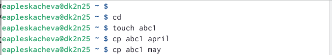

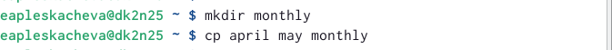

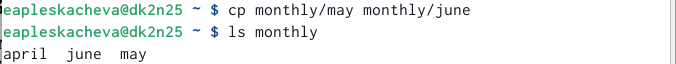

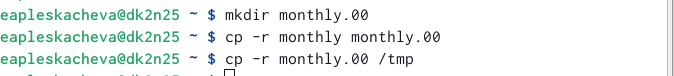

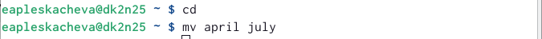

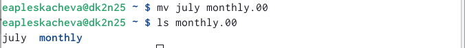

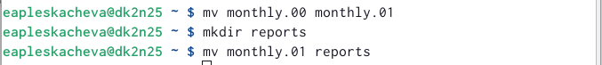

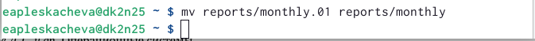

## 2. Выполнение заданий 

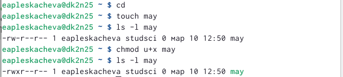

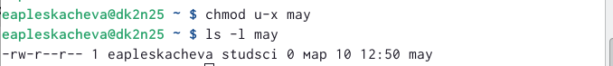

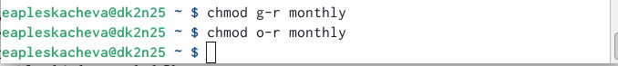

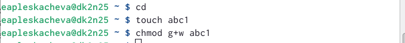

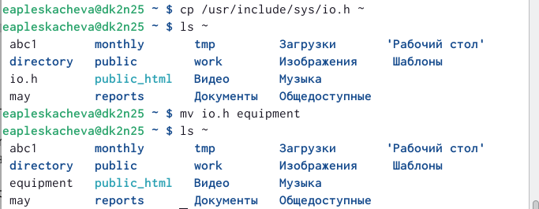

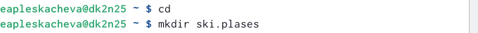

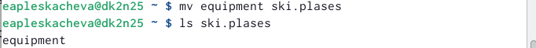

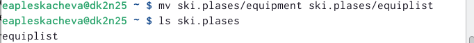

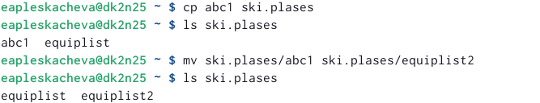

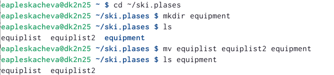

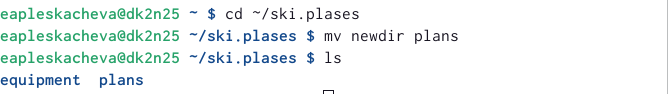

## 3. Определение опции команды chmod

 1. australia (a+r u+w u+x)
 2. play (a+x u+r u+w)
 3. my_os (a+r u+x)
 4. feathers (a+r a+w o-w)
 
## 4. Выполнение упражнений 

 1. Просмотрели содержимое файла с помощью команды ls /etc/password
 2. Скопировали файл ~/feathers в файл ~/file.old с помощью команды cp ~/feathers ~/file.old
 3. Переместили файл ~/file.old в каталог ~/play с помощью команды mv file.old ~/play
 4. Скопировали каталог ~/play в каталог ~/fun с помощью команды cp
 5. Переместили каталог ~/fun в каталог ~/play и назовите его games с помощью команды mv ~/fun ~/play/games
 6. Лишили владельца файла ~/feathers права на чтение с помощью команды chmod u-r
 7. Если просмотреть файл ~/feathers командой cat, то выдаётся ошибка “Отказано в доступе”
 8. Скопировать файл feathers не удаётся по той же ошибке
 9. Дали владельцу файла ~/feathers право на чтение с помощью команды
chmod u+r
 10. Лишили владельца каталога ~/play права на выполнение с помощью команды chmod u-x
 11. После выполнения команды перейти в каталог play не представляется возможным
 12. Дали владельцу каталога ~/play право на выполнение с помощью команды chmod u+x

## 5. Просмотр команд

 1. mount монтирует файловую систему
 2. fsck проверяет и исправляет ошибки файловой системы
 3. mkfs создаёт новую файловую систему
 4. kill принудительно завершает работу определённого процесса

# Выводы

Ознакомились с файловой системой Linux, её структурой, именами и содержанием каталогов. Приобрели практические навыки по применению команд для работы с файлами и каталогами, по управлению процессами (и работами), по проверке использования диска и обслуживанию файловой системы

