---
## Front matter
lang: ru-RU
title: Презентация по лабораторной работе №6
subtitle: Поиск файлов. Перенаправление ввода-вывода. Просмотр запущенных процессов
author:
  - Плескачева Е.А.
institute:
  - Российский университет дружбы народов, Москва, Россия
date: 17 марта 2023

## i18n babel
babel-lang: russian
babel-otherlangs: english

## Formatting pdf
toc: false
toc-title: Содержание
slide_level: 2
aspectratio: 169
section-titles: true
theme: metropolis
header-includes:
 - \metroset{progressbar=frametitle,sectionpage=progressbar,numbering=fraction}
 - '\makeatletter'
 - '\beamer@ignorenonframefalse'
 - '\makeatother'
---

# Информация

## Докладчик

:::::::::::::: {.columns align=center}
::: {.column width="70%"}

  * Плескачева Елизавета Андреевна
  * учебная группа: НММбд-02-22
  * студент направления Математика и Механика
  * Российский университет дружбы народов
  * [1132226461@pfur.ru](mailto:1132226461@pfur.ru)
  * <https://github.com/kukusb>

:::
::: {.column width="30%"}

:::
::::::::::::::

# Вводная часть

## Цель работы

Ознакомиться с инструментами поиска файлов и фильтрации текстовых данных. Приобрести практические навыки по управлению процессами (и заданиями), по проверке использования диска и обслуживанию файловых систем.

## Задание

• Выполнить все примеры, приведённые в первой части описания лабораторной работы
• Выполните действия, зафиксировав в отчёте по лабораторной работе используемые при этом команды и результаты их выполнения
• Создать отчёт и презентацию в Markdown
• Загрузить скринкасты на видео хостинг
• Представить работу на сайте ТУИС

# Выполнение лабораторной работы

## Шаг 1

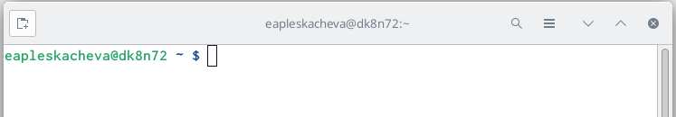

## Шаг 2

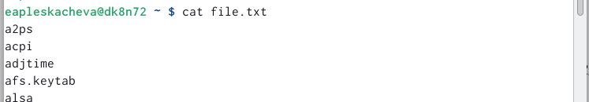

## Шаг 3

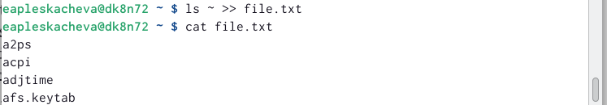

## Шаг 4

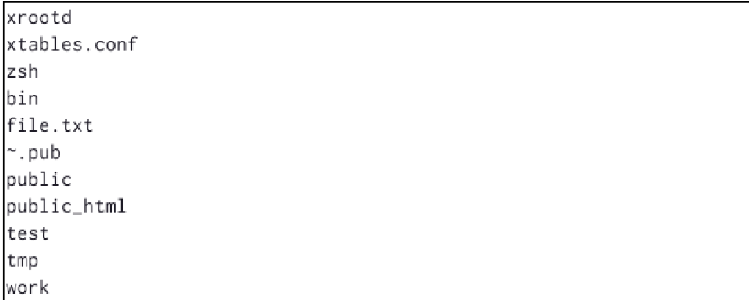

## Шаг 5

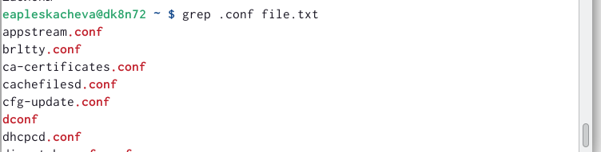

## Шаг 6

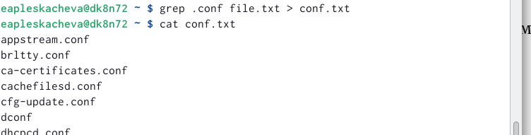

## Шаг 7

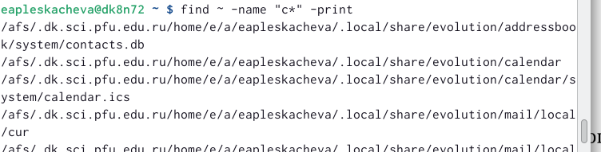

## Шаг 8

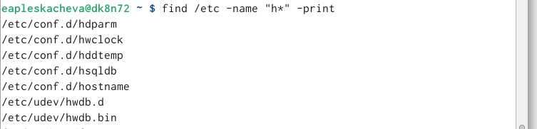

## Шаг 9

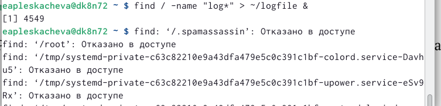

## Шаг 10

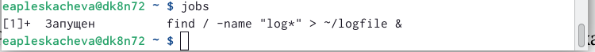

## Шаг 11

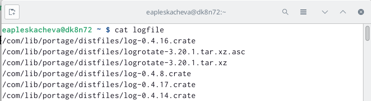

## Шаг 12

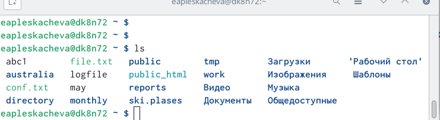

## Шаг 13

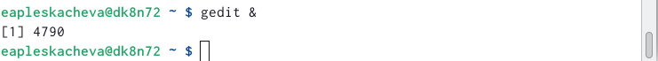

## Шаг 14

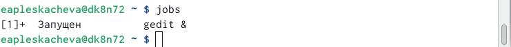

## Шаг 15

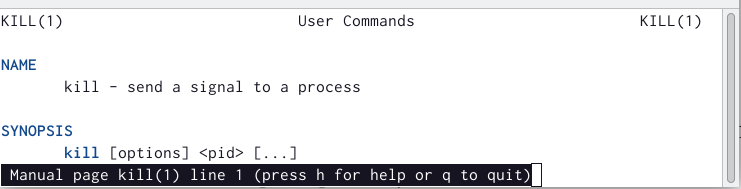

## Шаг 16

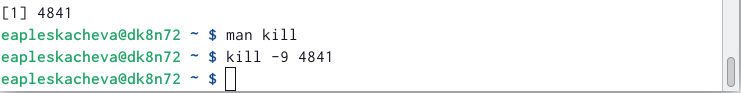

## Шаг 17

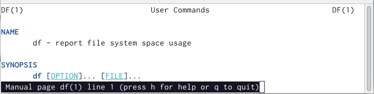

## Шаг 18

## Шаг 19

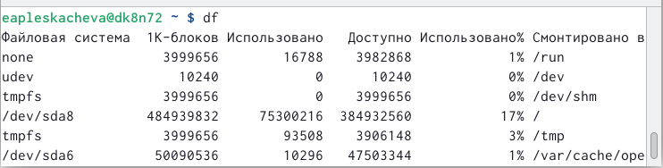

## Шаг 20

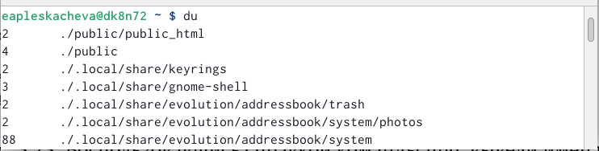

## Шаг 21

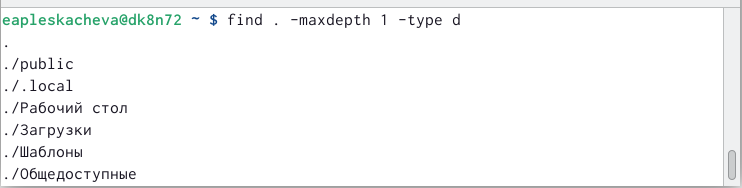

# Результаты работы

  С помощью type d мы попросили команду find искать только каталоги. С помощью maxdepth 1 мы попросили команду find сохранить поиск только на текущем уровне (и не заходить в подкаталоги). Введёная команда также показывает скрытые каталоги.

## Выводы

 Ознакомились с инструментами поиска файлов и фильтрации текстовых данных. Приобрели практические навыки по управлению процессами (и заданиями), по проверке использования диска и обслуживанию файловых систем.

