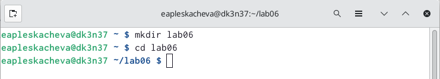
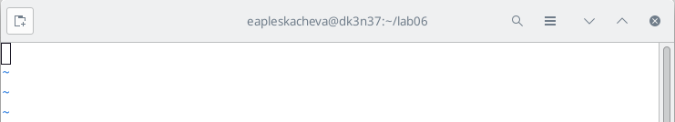
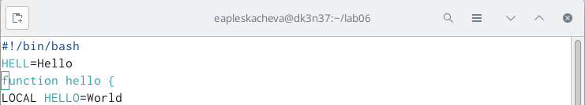
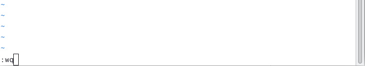
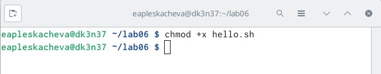
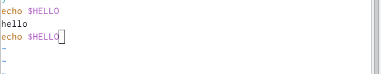
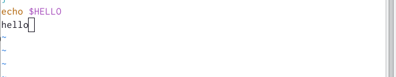

---
## Front matter
lang: ru-RU
title: Презентация по лабораторной работе №8
subtitle: Текстовый редактор vi
author:
  - Плескачева Е.А.
institute:
  - Российский университет дружбы народов, Москва, Россия
date: 31 марта 2023

## i18n babel
babel-lang: russian
babel-otherlangs: english

## Formatting pdf
toc: false
toc-title: Содержание
slide_level: 2
aspectratio: 169
section-titles: true
theme: metropolis
header-includes:
 - \metroset{progressbar=frametitle,sectionpage=progressbar,numbering=fraction}
 - '\makeatletter'
 - '\beamer@ignorenonframefalse'
 - '\makeatother'
---

# Информация

## Докладчик

:::::::::::::: {.columns align=center}
::: {.column width="70%"}

  * Плескачева Елизавета Андреевна
  * учебная группа: НММбд-02-22
  * студент направления Математика и Механика
  * Российский университет дружбы народов
  * [1132226461@pfur.ru](mailto:1132226461@pfur.ru)
  * <https://github.com/kukusb>

:::
::: {.column width="30%"}

:::
::::::::::::::

# Вводная часть

## Цель работы

Познакомиться с операционной системой Linux. Получить практические навыки работы с редактором vi, установленным по умолчанию практически во всех дистрибутивах.

## Задание

- Рассмотреть выполнение команд, приведённых в первой части описания лабораторной работы
- Выполнить действия, зафиксировав в отчёте по лабораторной работе используемые при этом команды и результаты их выполнения
- Создать отчёт и презентацию в Markdown
- Загрузить скринкасты на видео хостинг
- Представить работу на сайте ТУИС

# Выполнение лабораторной работы

# Задание 1 Создание нового файла с использованием vi

## Шаг 1

## Шаг 2

## Шаг 3

## Шаг 4

## Шаг 5

# Задание 2 Редактирование существующего файла

## Шаг 1

## Шаг 2

## Шаг 3

## Шаг 4

# Заключение

## Выводы

Познакомились с операционной системой Linux. Получили практические навыки работы с редактором vi, установленным по умолчанию практически во всех дистрибутивах.
